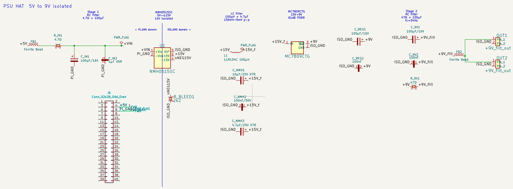
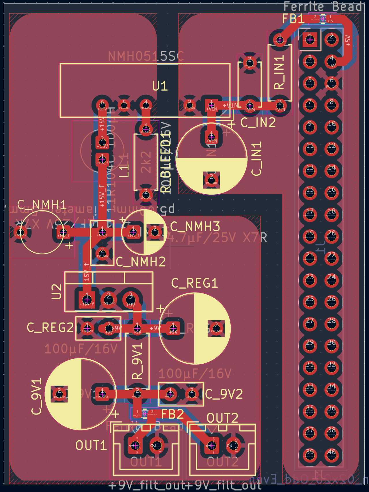

# Raspberry Pi Preamp PSU HAT — Rev 3

A KiCad-designed Raspberry Pi HAT that generates a clean, isolated +9V supply from the Pi's 5V GPIO rail, intended to power low-noise electret microphone preamplifier circuits (such as the [ESP P93](https://sound-au.com/project93.htm)) for field audio recording applications like [BirdNET-Pi](https://github.com/mcguirepr89/BirdNET-Pi).

## Schematic



## PCB Layout



## Overview

The Pi's 5V supply rail is noisy — unsuitable for sensitive microphone preamp circuits without significant filtering and regulation. This HAT addresses that with a multi-stage power supply chain:

1. **Stage 1 — Input filter**: Ferrite bead + capacitors attenuate high-frequency noise on the 5V input
2. **Isolated DC-DC conversion**: NMH0515SC converts 5V to ±15V with galvanic isolation, breaking any ground-loop path between the Pi and the preamp
3. **LC filter**: 100µH inductor + capacitors reduce switching noise from the DC-DC converter
4. **Linear regulation**: MC7809CTG drops the rectified +15V to a clean, regulated +9V
5. **Stage 2 — Output filter**: 47Ω series resistor + ferrite bead + multi-stage capacitor bank (100µF + 100nF) attenuates residual ripple before the output connectors

Two JST XH 2-pin output connectors (OUT1, OUT2) provide the filtered +9V, one per preamp channel.

## Key Components

| Designator | Part | Description |
|---|---|---|
| U1 | NMH0515SC | 5V → ±15V isolated DC-DC converter (Murata) |
| U2 | MC7809CTG | +9V linear regulator, TO-220 |
| L1 | 11R104C | 100µH radial inductor |
| FB1, FB2 | — | 0603 ferrite beads |
| J1 | 2×20 pin socket | Raspberry Pi GPIO header |
| OUT1, OUT2 | JST XH B2B | +9V filtered output connectors |

Full bill of materials: [`rpi-preamp-psu-hat-BoM.csv`](rpi-preamp-psu-hat-BoM.csv)

## Usage

### Hardware stack

```
[Raspberry Pi 4B]
      ↓ GPIO (5V + GND)
[This PSU HAT]
      ↓ JST XH (filtered +9V)
[P93 Stereo Preamp board]  ← electret capsules (EM272 or similar)
      ↓ balanced XLR
[HiFiBerry DAC+ ADC Pro]
      ↓ GPIO
[Raspberry Pi 4B]
```

### Stacking height

The HAT uses tall through-hole electrolytics (C_9V1, C_REG1: 100µF/16V, 8mm body). When stacking additional HATs, use an extra-tall stacking header to clear the tallest capacitors:

- **10mm stacking header** — [Adafruit #2223](https://www.adafruit.com/product/2223) (minimum clearance)
- **23mm stacking header** — [Adafruit #1979](https://www.adafruit.com/product/1979) (recommended)

Add M2.5 standoffs at the corner mounting holes for mechanical stability.

## Files

| File | Description |
|---|---|
| `rpi-preamp-psu-hat.kicad_sch` | KiCad schematic |
| `rpi-preamp-psu-hat.kicad_pcb` | KiCad PCB layout |
| `rpi-preamp-psu-hat.kicad_pro` | KiCad project file |
| `rpi-preamp-psu-hat-BoM.csv` | Bill of materials |
| `gerbers/` | Gerber files ready for fab |
| `gerbers.zip` | Gerber zip for direct upload to PCB fab |

## Fabrication Notes

- Board is designed for standard 2-layer FR4

## License

Released under [CERN Open Hardware Licence v2 – Strongly Reciprocal (CERN-OHL-S)](https://ohwr.org/cern_ohl_s_v2.txt). Derivatives must be released under the same license with design files made available.
